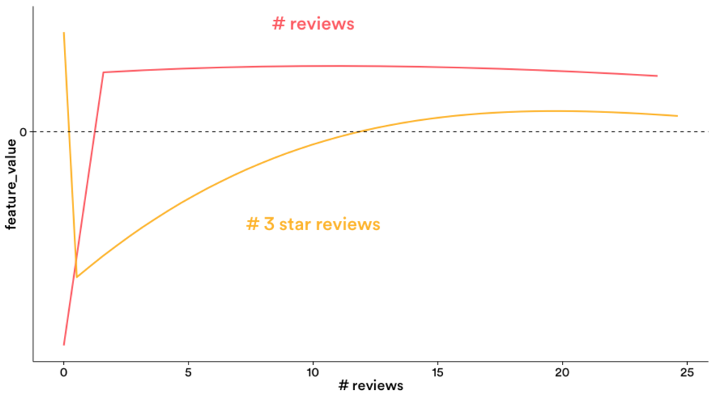

aerosolve
=========

Machine learning **for humans**.

What is it?
-----------

A machine learning library designed from the ground up to be human friendly.
It is different from other machine learning libraries in the following ways:

  * A [thrift based feature representation](https://github.com/airbnb/aerosolve/tree/master/core/src/main/thrift) that enables pairwise ranking loss and single context multiple item representation.
  * A [feature transform language](https://github.com/airbnb/aerosolve/tree/master/core/src/main/java/com/airbnb/aerosolve/core/transforms) gives the user a lot of control over the features
  * Human friendly [debuggable models](https://github.com/airbnb/aerosolve/tree/master/core/src/main/java/com/airbnb/aerosolve/core/models)
  * Separate lightweight [Java inference code](https://github.com/airbnb/aerosolve/tree/master/core/src/main/java/com/airbnb/aerosolve/core)
  * Scala code for [training](https://github.com/airbnb/aerosolve/tree/master/training/src/main/scala/com/airbnb/aerosolve/training)
  * Simple [image content analysis code](https://github.com/airbnb/aerosolve/tree/master/core/src/main/java/com/airbnb/aerosolve/core/images) suitable for ordering or ranking images

This library is meant to be used with sparse, interpretable features such as those that commonly occur in search
(search keywords, filters) or pricing (number of rooms, location, price). It is not as interpretable with problems with very dense
non-human interpretable features such as raw pixels or audio samples.

There are a few reasons to focus on interpretability:

  * Your corpus is new and not fully defined and you want more insight into your corpus
  * Having interpretable models lets you iterate quickly. Figure out where the model disagrees most and have insight into what kind of new features are needed.
  * Debugging noisy features. By plotting the feature weights you can discover buggy features or fit them to splines and discover features that are unexpectedly complex (which usually indicates overfitting).
  * You can discover relationships between different variables and your target prediction. e.g. For the Airbnb demand model, plotting graphs of reviews and 3-star reviews is more interpretable than many nested if then else rules.

How to get started?
-------------------

The artifacts for aerosolve are [hosted on bintray](https://bintray.com/airbnb/aerosolve). If you use Maven, SBT or Gradle you can just point to bintray
as a repository and automatically fetch the artifacts.

Check out the image impression demo where you can learn how to teach
the algorithm to paint in the pointillism style of painting.
[Image Impressionism Demo.](https://github.com/airbnb/aerosolve/tree/master/demo/image_impressionism)

There is also an income prediction demo based on a popular
machine learning benchmark.
[Income Prediction Demo.](https://github.com/airbnb/aerosolve/tree/master/demo/income_prediction)

Feature Representation
----------------------

This section dives into the [thrift based feature representation.](https://github.com/airbnb/aerosolve/tree/master/core/src/main/thrift)

Features are grouped into logical groups called families of features. The reason for this is so we can express transformations on an entire feature family
at once or interact two different families of features together to create a new feature family.

There are three kinds of features per FeatureVector:

  * stringFeatures - this is a map of feature family to binary feature strings. For example "GEO" -> { "San Francisco", "CA", "USA" }
  * floatFeatures - this is a map of feature family to feature name and value. For example "LOC" -> { "Latitude" : 37.75, "Longitude" : -122.43 }
  * denseFeatures - this is a map of feature family to a dense array of floats. Not really used except for the image content analysis code.

Example Representation
----------------------

Examples are the basic unit of creating training data and scoring.
A single example is composed of:

  * context - this is a FeatureVector that occurs once in the example. It could be the features representing a search session for example. e.g. "Keyword" -> "Free parking"
  * example(0..N) - this is a repeated list of FeatureVectors that represent the items being scored. These can correspond to documents in a search session. e.g. "LISTING CITY" -> "San Francisco"

The reasons for having this structure are:

  * having one context for hundreds of items saves a lot of space during RPCs or even on disk
  * you can compute the transforms for the context once, then apply the transformed context repeatedly in conjunction with each item
  * having a list of items allows the use of list based loss functions such as pairwise ranking loss, domination loss etc where we evaluate multiple items at once

Feature Transform language
--------------------------

This section dives into the [feature transform language](https://github.com/airbnb/aerosolve/tree/master/core/src/main/java/com/airbnb/aerosolve/core/transforms)

Feature transforms are applied with a separate [transformer module](https://github.com/airbnb/aerosolve/blob/master/core/src/main/java/com/airbnb/aerosolve/core/transforms/Transformer.java) that is decoupled from the model. This allows the user to break apart transforms or transform data ahead of time of scoring for example. e.g. in an application the items in a corpus may be transformed ahead of time and stored, while the context is not known until runtime. Then at runtime, one can transform the context and combined them with each transformed item to get the final feature vector that is then fed to the models.

Feature transforms allow us to modify FeatureVectors on the fly. This allows engineers to rapidly iterate on feature engineering
quickly and in a controlled way.

Here are some examples of feature transforms that are commonly used:

  * [List transform](https://github.com/airbnb/aerosolve/blob/master/core/src/main/java/com/airbnb/aerosolve/core/transforms/ListTransform.java). A meta transform that specifies other transforms to be applied
  * [Cross transform](https://github.com/airbnb/aerosolve/blob/master/core/src/main/java/com/airbnb/aerosolve/core/transforms/CrossTransform.java). Operates only on stringFeatures. Allows interactions between two different string feature families. e.g. "Keyword" cross "LISTING CITY" creates the new feature family "Keyword_x_city" -> "Free parking^San Francisco"
  * [Multiscale grid transform](https://github.com/airbnb/aerosolve/blob/master/core/src/main/java/com/airbnb/aerosolve/core/transforms/MultiscaleGridQuantizeTransform.java) Constructs multiple nested grids for 2D coordinates. Useful for modelling geography.

Please see the [corresponding unit tests](https://github.com/airbnb/aerosolve/tree/master/core/src/test/java/com/airbnb/aerosolve/core/transforms) as to what these transforms do, what kind of features they operate on and what kind of config they expect.

Models
------

This section covers [debuggable models](https://github.com/airbnb/aerosolve/tree/master/core/src/main/java/com/airbnb/aerosolve/core/models)

Although there are several models in the model directory only two are the main debuggable models. The rest are experimental or sub-models that create transforms for the interpretable models.

[Linear model.](https://github.com/airbnb/aerosolve/blob/master/core/src/main/java/com/airbnb/aerosolve/core/models/LinearModel.java)
Supports hinge, logistic, epsilon insensitive regression, ranking loss functions.
Only operates on stringFeatures.
The label for the task is stored in a special feature family and specified by rank_key in the config.
See the [linear model unit tests](https://github.com/airbnb/aerosolve/blob/master/training/src/test/scala/com/airbnb/aerosolve/training/LinearClassificationTrainerTest.scala) on how to set up the models.
Note that in conjunction with quantization and crosses you can get incredible amounts of complexity from the "linear" model, so it is not actually your regular linear model but something more complex and can be thought of as a bushy, very wide decision tree with millions of branches.

[Spline model.](https://github.com/airbnb/aerosolve/blob/master/core/src/main/java/com/airbnb/aerosolve/core/models/SplineModel.java)
A general additive linear piecewise spline model.
The training is done at a higher resolution specified by num_buckets between the min and max of a feature's range.
At the end of each iteration we attempt to project the linear piecewise spline into a lower dimensional function such as a polynomial spline with Dirac delta endpoints.
If the RMSE of the projection is above threshold, we leave the spline alone in the high resolution piecewise linear mode.
This allows us to debug the spline model for features that are buggy or unexpectedly complex (e.g. jumping up and down when we expect some kind of smoothness)

   * Boosted stumps model - small compact model. Not very interpretable but at small sizes useful for feature selection.
   * Decision tree model - in memory only. Mostly used to generate transforms for the linear or spline model.
   * Maxout neural network model. Experimental and mostly used as a comparison baseline.

Support
-------

Dev group :  https://groups.google.com/forum/#!forum/aerosolve-dev
User group : https://groups.google.com/forum/#!forum/aerosolve-users
